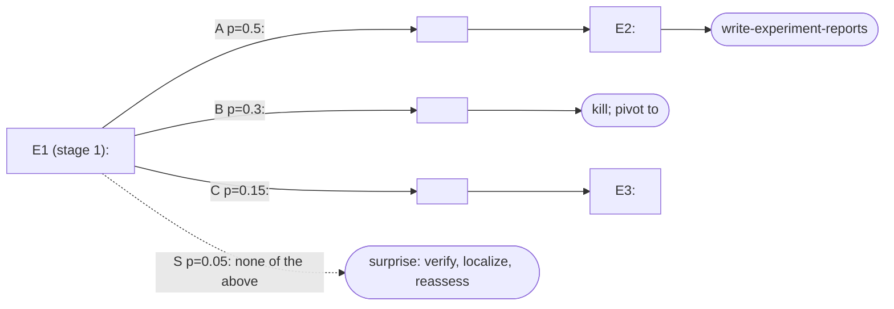

# Roadmap template

`plan.md` centers on a Mermaid decision tree plus one short section per
experiment. Conventions:

- Experiments are rectangles named `E1`, `E2`, ... in planned order; `E1` is
  the stage-1 kill-capable experiment.
- Predicted branches are labeled edges carrying the branch letter, credence,
  and outcome class, matching `predictions.md` exactly.
- The surprise branch is a dashed edge into a surprise-protocol node.
- Kill and pivot targets are stadium nodes; pivots name the runner-up
  candidate from `candidates.md`.
- Handoffs to sibling skills are stadium nodes too: `launch-theory-agent`
  for a theory branch, `write-experiment-reports` once runs complete,
  `write-deep-learning-papers` for the endgame.
- As results land, prefix node labels with status — `[running]`, `[done: B]`
  (observed branch) — and keep edges unchanged so the prediction record
  stays visible.

Skeleton to specialize:

Each experiment's section below the diagram states: the question it answers,
the settings that differ from common protocol, cost estimate, and a pointer
to its rows in `predictions.md`. Do not restate the branch table in prose.

Where the platform can render the diagram inline (for example Claude Code
artifacts, or GitHub's Mermaid rendering), show it to the user rather than
only linking the file; the roadmap is the surface the user reacts to.
